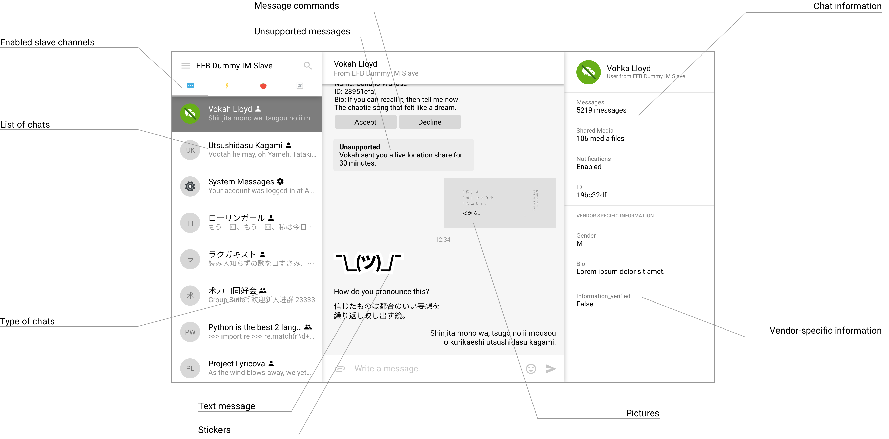

Master channels
===============

Master channels are the interface that directly
or indirectly interact with the user. Despite the
first master channel of EFB (EFB Telegram Master)
is written in a form of Telegram Bot, master channels
can be written in many forms, such as:

* A web app
* A server that expose APIs to dedicated desktop and
  mobile clients
* A chat bot on an existing IM
* A server that compiles with a generic IM Protocol
* A CLI client
* Anything else you can think of...

Design guideline
----------------

When the master channel is implemented on an existing
protocol or platform, as far as possible, while
considering the user experience, a master channel should:

* maintain one conversation thread per chat, indicating
  its name, source channel and type;
* support all, if not most, types of messages defined
  in the framework, process and deliver messages
  between the user and slave channels;
* support all, if not most, features of messages,
  including: targeted message reply, chat substitution
  in text (usually used in @ references), commands, etc.
  Master channel should be able to process incoming
  messages with such features, and send messages with
  such features to slave channels if applicable;
* be able to invoke and process "additional features"
  offered by slave channels.

Optionally, a master channel can also support / identify
vendor-specified information from certain slave channels.

    An example of an ideal design of a master channel,
    inspired by Telegram Desktop

Depends on your implementation, a master channel may
probably needs to maintain a list of chats and messages,
for presentation or other purposes.

Message delivery
----------------

Note that sometimes users may send messages outside of
this EFB session, so that slave channels might provide a
message has its author marked as "self".

Implementation details
----------------------

See :class:`EFBChannel`.