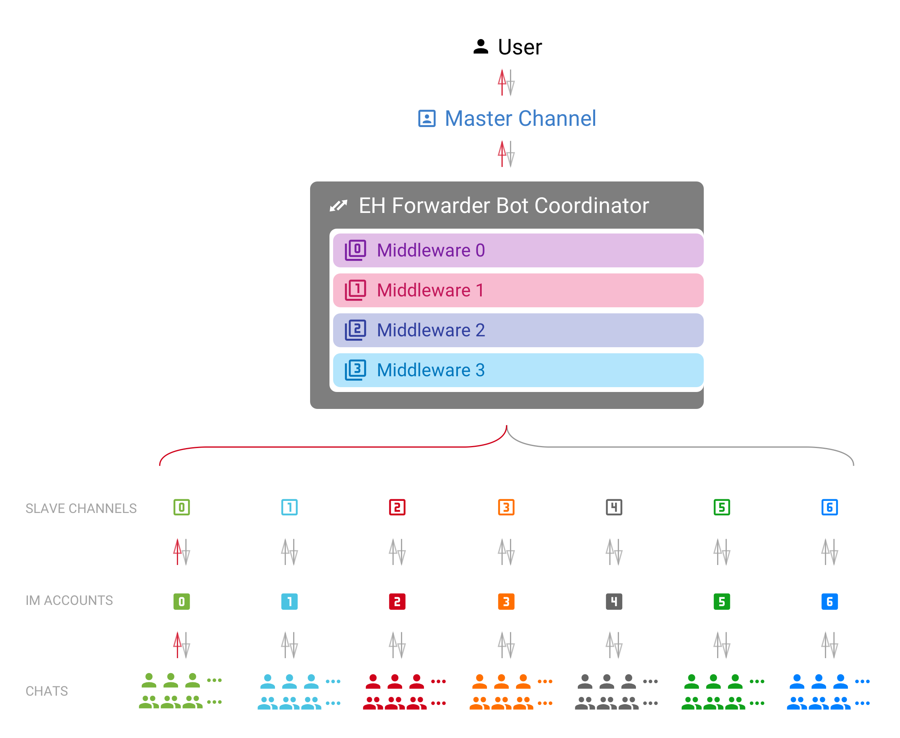

Walk-through — How EFB works
============================

EH Forwarder Bot is an extensible framework that allows
user to control and manage accounts from different chat
platforms in a unified interface. It consists of 4 parts:
a Master Channel, some Slave Channels, some Middlewares
and a Coordinator.

.. glossary::

    master channel
        The channel that directly interact with :term:`the User`.
        It is guaranteed to have one and only one master
        channel in an EFB session.

    slave channel
        The channel that delivers messages to and from
        their relative platform. There is at lease one
        slave channel in an EFB session.

    coordinator
        Component of the framework that maintains the
        instances of channels, and delivers messages between
        channels.

    middleware
        Module that processes messages and statuses
        delivered between channels, and make modifications
        where needed.

Concepts to know
----------------

.. glossary::
    module
        A common term that refers to both channels and
        middlewares.

    the User
    the User Themself
        This term [#f1]_ can refer to the user of the current instance
        of EH Forwarder Bot, operating the master channel, and
        the account of an IM platform logged in by a slave
        channel.

    chat
        A place where conversations happen, it can be either a
        :term:`private chat`, a :term:`group chat`, or a
        :term:`system chat`.

    private chat
        A conversation with a single person on the IM platform.
        Messages from a private conversation shall only has an
        author of :term:`the User Themself`, the other person, or a
        “system member”.

        For platforms that support bot or something similar,
        they would also be considered as a “user”, unless
        messages in such chat can be sent from any user other
        than the bot.

        For chats that :term:`the User` receive messages, but cannot
        send message to, it should also be considered as a
        private chat, only to raise an exception when messages
        was trying to send to the chat.

    group chat
        A chat that involves more than two members. A group chat
        MUST provide a list of members that is involved in the
        conversation.

    system chat
        A chat that is a part of the system. Usually used for
        chats that are either a part of the IM platform, the
        :term:`slave channel`, or a :term:`middleware`.
        :term:`Slave channel`\ s can use this chat type to send
        system message and notifications to the master channel.

    chat member
        A participant of a chat. It can be :term:`the User Themself`,
        another person or bot in the chat, or a virtual one
        created by the IM platform, the :term:`slave channel`, or a
        :term:`middleware`.

    message
        Messages are delivered strictly between the master
        channel and a slave channel. It usually carries
        an information of a certain type.

        Each message should at least have a unique ID that is
        distinct within the slave channel related to it. Any
        edited message should be able to be identified with
        the same unique ID.

    status
        Information that is not formatted into a message. Usually
        includes updates of chats and members of chats, and
        removal of messages.

Slave Channels
--------------

The job of slave channels is relatively simple.

1. Deliver messages to and from the master channel.
2. Maintains a list of all available chats, and group members.
3. Monitors changes of chats and notify the master channel.

Features that does not fit into the standard EFB Slave Channel
model can be offered as :ref:`slave-additional-features`.

Master Channels
---------------

Master channels is relatively more complicated and also
more flexible. As it directly faces the User, its user
interface should be user-friendly, or at least friendly
to the targeted users.

The job of the master channel includes:

1. Receive, process and display messages from slave
   channels.
2. Display a full list of chats from all slave channels.
3. Offer an interface for the User to use "extra functions"
   from slave channels.
4. Process updates from slave channels.
5. Provide a user-friendly interface as far as possible.

Middlewares
-----------

Middlewares can monitor and make changes to or nullify
messages and statuses delivered between channels.
Middlewares are executed in order of registration, one
after another. A middleware will always receive the
messages processed by the preceding middleware if
available. Once a middleware nullify a message or status,
the message will not be processed and delivered any
further.

.. rubric:: Footnotes

.. [#f1] “Themself” here is used as a derived form of a
    gender-neutral singular third-person pronoun.
